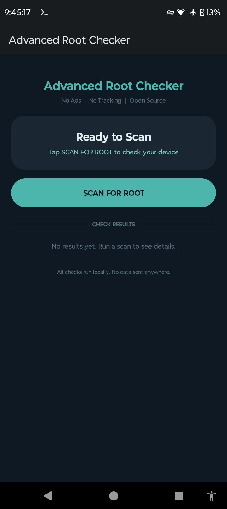

## Latest Version: 2.0
Material You redesign with dark teal theme,
rounded cards and smooth animations.

Advanced Root Checker is a free, open-source Android app that 
detects root indicators on your device. All 15 checks run 
entirely offline — no internet connection required, no data 
sent anywhere, no ads, no tracking.

Detects: su binaries, Magisk, SuperSU, BusyBox, Xposed, 
dangerous system properties, SELinux status, writable /system, 
test-keys builds, and more.

Built with pure Java, no external libraries.
Licensed under GPL-3.0.

## Screenshots

## Build from Source

### Requirements
- Android device with Termux installed (from F-Droid)
- Or a PC with Java 17 and Android SDK

### Build on Android with Termux (recommended)

**Step 1 — Install dependencies:**
pkg update && pkg upgrade -y
pkg install openjdk-17 git aapt2 -y

**Step 2 — Set Java path:**
export JAVA_HOME=$PREFIX/lib/jvm/java-17-openjdk
export PATH=$PATH:$JAVA_HOME/bin

**Step 3 — Clone the project:**
git clone https://github.com/Laert-Android/Advanced-Root-Checker-
cd Advanced-Root-Checker-

**Step 4 — Install Android SDK:**
pkg install wget unzip -y
wget https://dl.google.com/android/repository/commandlinetools-linux-11076708_latest.zip
unzip commandlinetools-linux-11076708_latest.zip
mkdir -p ~/android-sdk/cmdline-tools/latest
mv cmdline-tools/* ~/android-sdk/cmdline-tools/latest/
export ANDROID_HOME=~/android-sdk
export PATH=$PATH:$ANDROID_HOME/cmdline-tools/latest/bin
yes | sdkmanager --licenses
sdkmanager "platforms;android-34" "build-tools;34.0.0"

**Step 5 — Configure and build:**
gradle wrapper
echo "sdk.dir=$HOME/android-sdk" > local.properties
echo "android.aapt2FromMavenOverride=/data/data/com.termux/files/usr/bin/aapt2" > gradle.properties
./gradlew assembleDebug

**Step 6 — Sign the APK:**
keytool -genkey -noprompt \
  -keystore ~/my.keystore \
  -alias mykey \
  -keyalg RSA \
  -keysize 2048 \
  -validity 10000 \
  -storepass android123 \
  -keypass android123 \
  -dname "CN=Dev,OU=Dev,O=Dev,L=City,ST=State,C=US"

cp app/build/outputs/apk/debug/app-debug.apk /sdcard/Download/RootChecker.apk

apksigner sign \
  --ks ~/my.keystore \
  --ks-pass pass:android123 \
  --key-pass pass:android123 \
  /sdcard/Download/RootChecker.apk

**Step 7 — Install:**
Open your file manager, go to Downloads
and tap RootChecker.apk to install.

### Build on PC

git clone https://github.com/Laert-Android/Advanced-Root-Checker-
cd Advanced-Root-Checker-
echo "sdk.dir=/path/to/your/android-sdk" > local.properties
gradle wrapper
./gradlew assembleDebug
# APK at: app/build/outputs/apk/debug/app-debug.apk
