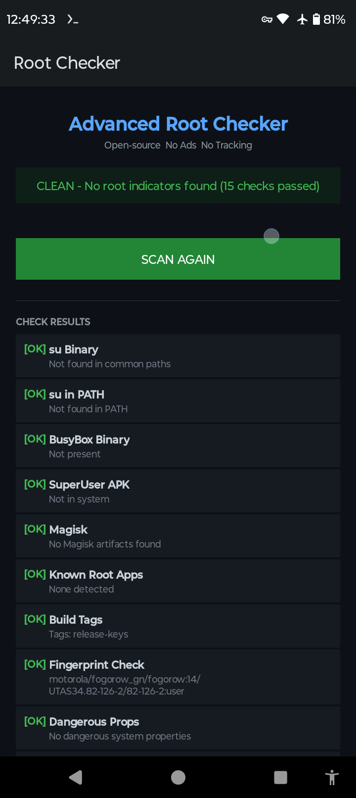

Advanced Root Checker is a free, open-source Android app that 
detects root indicators on your device. All 15 checks run 
entirely offline — no internet connection required, no data 
sent anywhere, no ads, no tracking.

Detects: su binaries, Magisk, SuperSU, BusyBox, Xposed, 
dangerous system properties, SELinux status, writable /system, 
test-keys builds, and more.

Built with pure Java, no external libraries.
Licensed under GPL-3.0.

## Screenshots

## Build from Source

### Requirements
- Java 17
- Android SDK (API 34)
- Gradle

### Steps

1. Clone the repository
   git clone https://github.com/Laert-Android/Advanced-Root-Checker
   cd Advanced-Root-Checker

2. Set your Android SDK path
   echo "sdk.dir=/path/to/your/android-sdk" > local.properties

3. Build the APK
   gradle wrapper
   ./gradlew assembleDebug

4. The APK will be at
   app/build/outputs/apk/debug/app-debug.apk

### On Termux (Android)
   pkg install openjdk-17
   pkg install aapt2
   git clone https://github.com/Laert-Android/Advanced-Root-Checker
   cd Advanced-Root-Checker
   gradle wrapper
   echo "sdk.dir=$HOME/android-sdk" > local.properties
   echo "android.aapt2FromMavenOverride=/data/data/com.termux/files/usr/bin/aapt2" > gradle.properties
   ./gradlew assembleDebug
